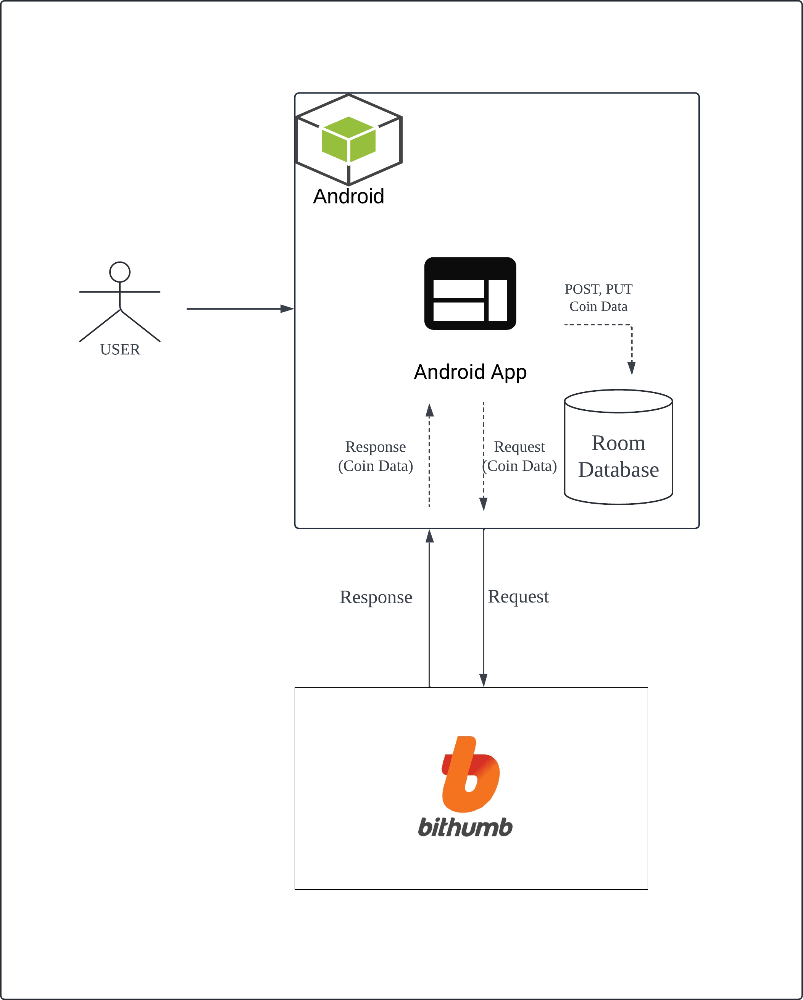

# COCO


## 1. 프로젝트 개요
COCO (CoinApp)은 Android(Kotlin), RoomDB와 빗썸 API를 사용하여 실시간 암호화폐 데이터를 관리할 수 있는 앱입니다.

> **Initial Development** : 2023.12.12 ~ 2024.1.9


## 2. 주요 기능
- 코인 가격 데이터 조회 : 사용자가 관심 있는 코인 가격 데이터를 로컬 RoomDB에 저장하고 조회합니다.
- 관심있는 코인 관리 : 좋아요 버튼을 통해 관심있는 코인을 저장 및 관리할 수 있습니다.


## 3. Project Architecture



## 4. Tech Stacks

> **(1) Android Studio IDE**  
- Giraffe | 2022.3.1
    - 설치 URL : https://developer.android.com/studio?hl=ko

- VM: OpenJDK 64-Bit Server

> **(2) Kotlin**
- Kotlin version : 1.9.0

> **(3) AVD(Android Virtual Device)**
- AVD displayname : Pixel_3a_API_34_extension_level_7_x86_64
- AVD Encoding : UTF-8
- API level : 34


## 5. Project Structure
```bash
src
├── App.kt   // Android App 메인 클래스
├── background   // 백그라운드 작업 처리 
│   ├── GetCoinPriceRecentContractedWorkManager.kt  // 최근 거래된 코인 가격 내역을 가져오는 WorkManager
├── dataModel  // 데이터 모델 클래스 (데이터 구조 정의)
├── dataStore  // 사용자가 앱에 처음 접속했는지 여부를 관리
├── db
│   ├── dao   // 데이터 접근 객체(DAO) 인터페이스
│   └── entity   // 데이터베이스 Entity 클래스 (RoomDB 테이블과 매핑)
├── network
│   └── model  // API 호출과 응답에 사용되는 데이터 모델
├── receiver     // 기기 부팅시, 백그라운드에서 코인 가격 정보를 업데이트
├── repository   // 데이터 처리 로직을 관리하는 repository
├── service   // 코인 가격 정보를 가져와서 알림으로 표시
└── view
    ├── adapter   // RecyclerView에서 사용되는 어댑터 클래스
    ├── intro    // 인트로 화면 관련 UI 및 로직
    ├── main    // 메인 화면 관련 UI 및 로직
    └── setting  // notification 알림창 설정

res   
├── drawble // app 화면 구성에 필요한 UI 이미지
└── layout  // app 화면 레이아웃 리소스 파일 (XML 형식)
```


## 6. Installation
```bash
(1) git clone
git clone https://github.com/eldhdpswl/coinApp.git

(2) Android Studio에서 프로젝트 열기
Android Studio를 열고, clone한 파일 실행.
```

## 7. Future Improvements
- 클라우드 기반 백엔드 서버 구축: 로컬 데이터베이스의 한계를 보완하기 위해 Spring Boot를 사용하여 서버를 구축하고, AWS에 배포할 예정
